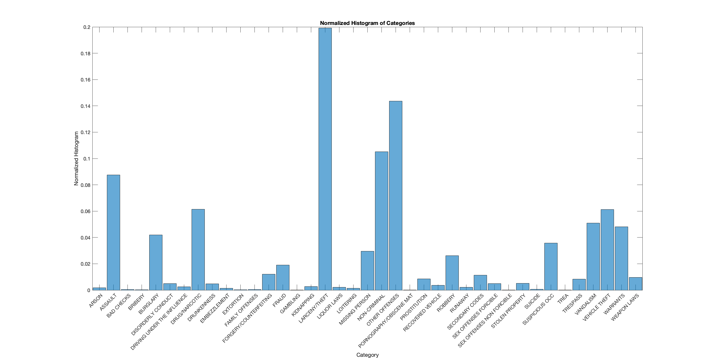
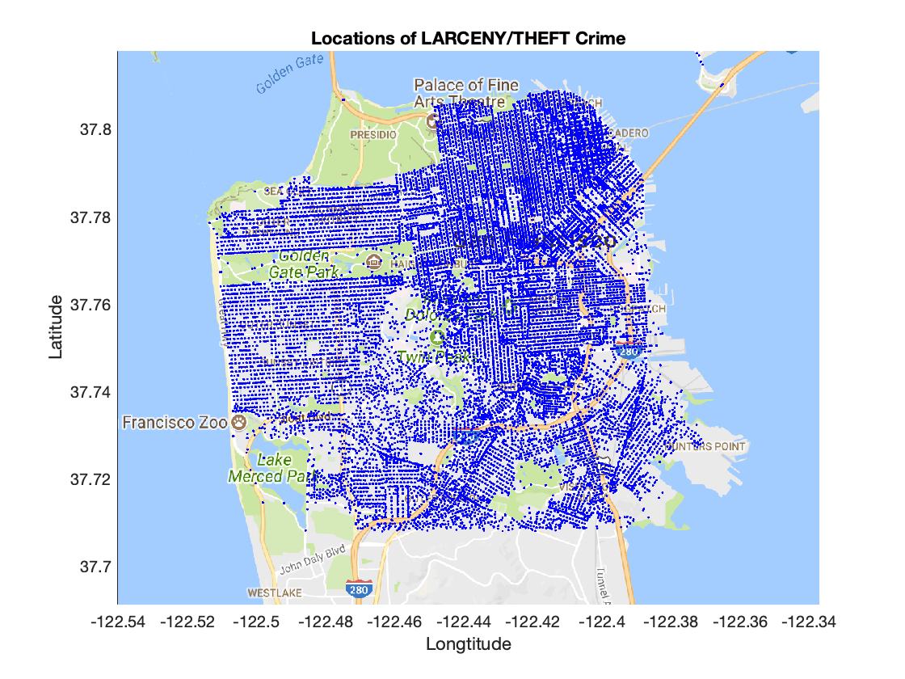

# Data Visualization 

In this section, we visualize our data to get a better sense of crime categories and their relationship with the slected features: Date, DayofWeek, and pdDistrict. 

#### Normalized Histogram of Crime Categories

Based on this figure, we can see **Larceny/Theft** is the most common crime category. 

#### Locations of Larceny/Theft Crime
Here we demostrate the locations of Larceny/Theft crime on the google map.

