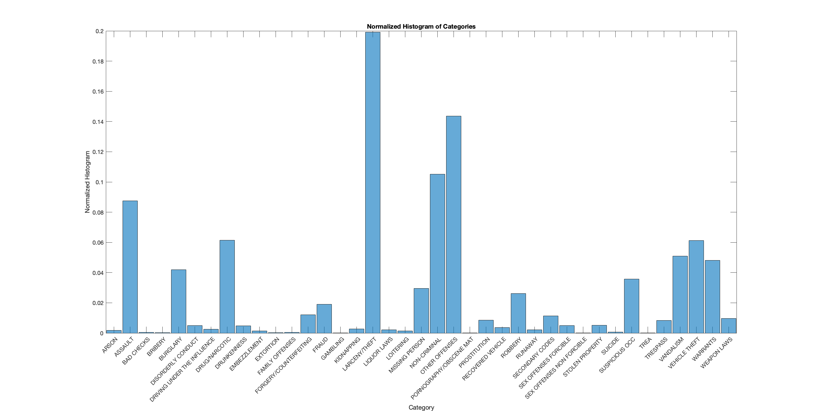
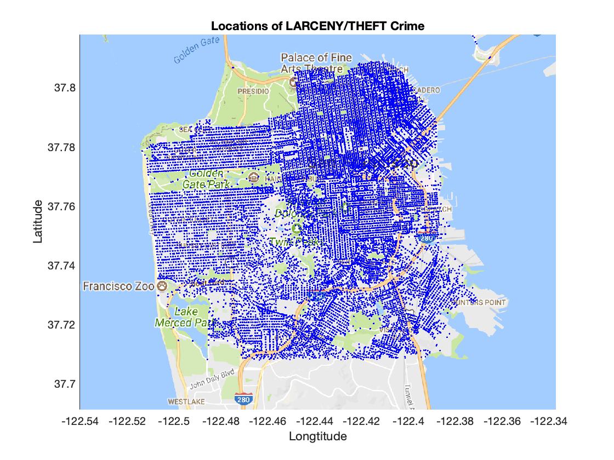
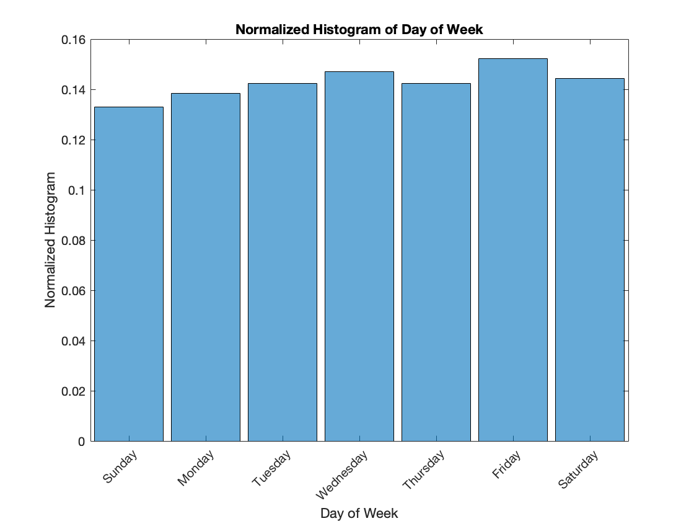
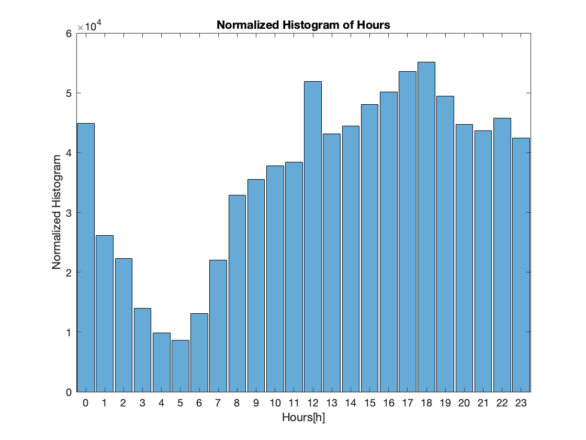
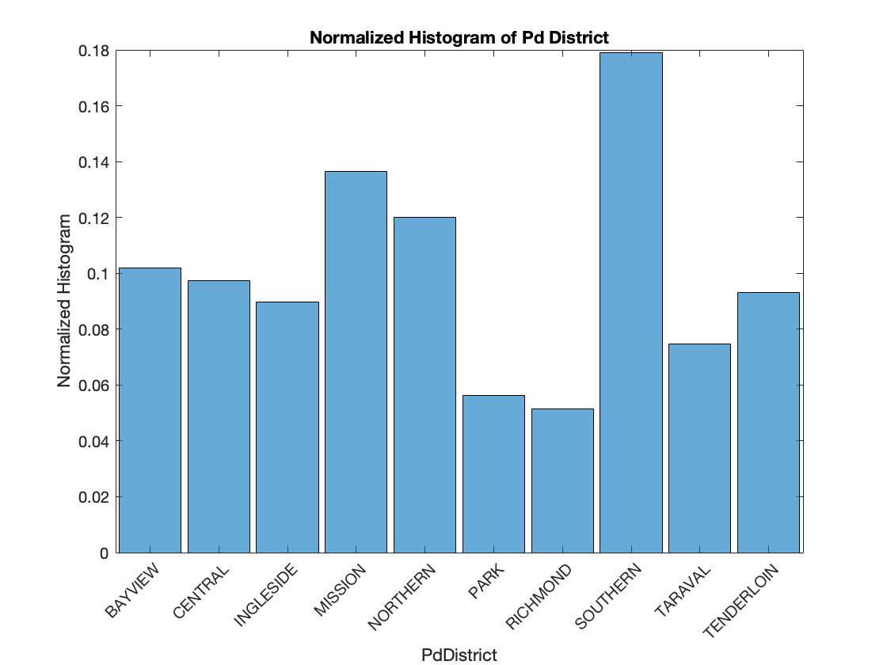
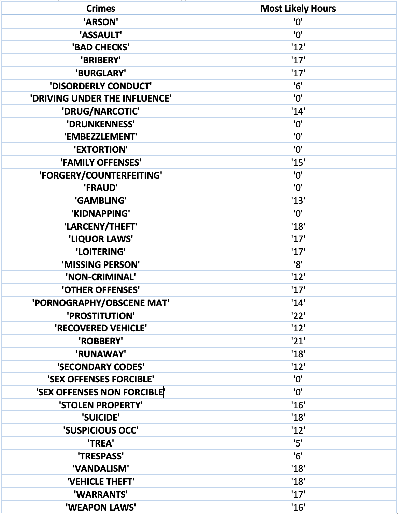
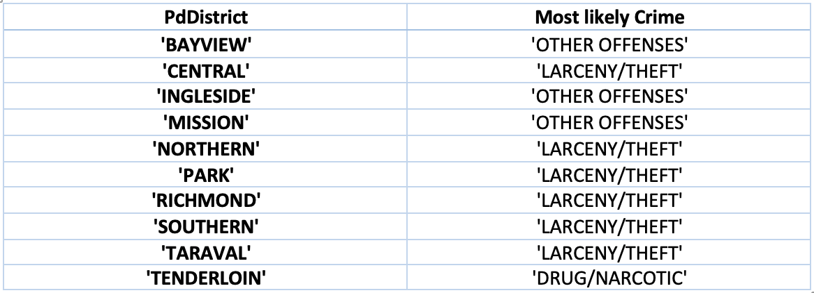

## Data Visualization 

In this section, we visualize our data to get a better sense of crime categories and their relationship with the slected features: Date, DayofWeek, and pdDistrict. 

#### Normalized Histogram of Crime Categories

Based on this figure, we can see **Larceny/Theft** is the most common crime category. 

#### Locations of Larceny/Theft Crime
Here we demostrate the locations of Larceny/Theft crime on the google map.

  

#### Normalized Histogram of Features
 We plot normalized histogram of crime for versus Date, DayofWeek, and pdDistrict. The first one shows crime frequancy for days of week, and we see most of the crimes occured on **Friday**. 

  Next one illustrates frequency of crime over 24 hours, and time 18:00 is the peak hour of crimes. 
 
 
  
  
  Finally, we see crime frequancy in different pdDistricts which indicates Southern area has the most number of crime scenes. 
  
   
 
     
 
#### Most Likely Type of Crimes
Here we provide the two tables which shows most likely hour of occurance of each type of crime, and most likely type of crime within each pdDistrict respectively 
     
   
 
     
Most likely type of crime within each pdDistrict 
     
   
 
